# README
## Device + OmniAuth (with guest appearance: Rails Credentials)
Fork and open this repo i nyour favorite editor to get started.

## Step One:
  - Let's install gems for devise. In your gem file add:
    ```
      gem 'devise'
      gem 'ruby_parser'
      gem 'nokogiri'
    ```
  - run `bundle install`

## Step Two:
  - Set up devise.
      run `rails g devise:install`
  - Create a devise model.  It can be named anything but here we will use 'user'.
      run `rails g devise user`
  - Migrate.  If you are using postgresql, you'll need to create the database first.
    If not skip the create command.
      run `rails db:create`
      run `rails db:migrate`

## Step Three:
  - Set up devise views.
      run `rails g devise:views`
  - Add a home page to test on.
      in config/routes.rb add `root to: 'application#welcome'`
      in your views folder add a new folder called 'application'
      in the application folder you just created add a file called 'welcome.html.erb'
      in the welcome file add:
        ```
        <% if user_signed_in? %>
          <h1> Hello <%= current_user.email.split("@")[0]%> </h1>
          <h2><%= link_to('Logout', destroy_user_session_path, method: :delete)%></h2>
        <% else %>
          <h1>Welcome</h1>
        <% end %>
        ```

## Step Four:
  - Signup for your Oauth ids.

  - Facebook signup at: [facebook developer](developers.facebook.com)\
      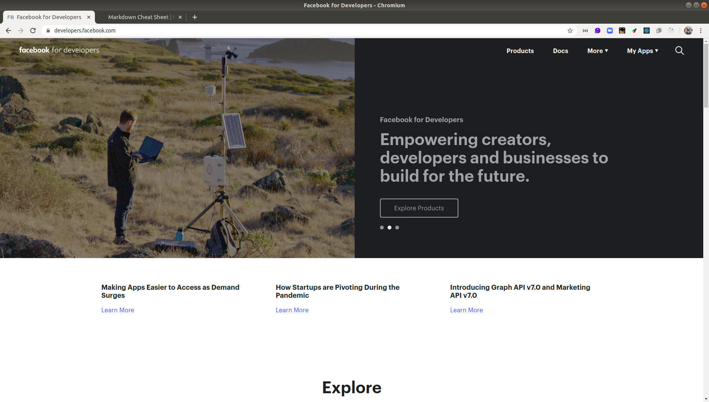
      ---
      ---
  - under 'my apps' go to create app,\
      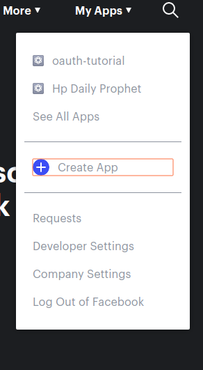
      ---
      ---
  - give your app a name, create app id.\
      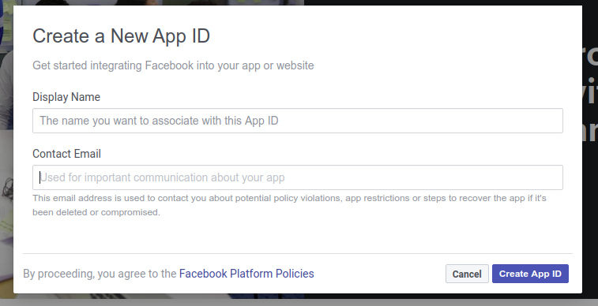
      ---
      ---
  - Go to settings, basic.\
      
      ---
      ---
  - Here you will want to grab the app id and app secret.\
      
      ---
      ---
  - Copy and paste those somewhere safe.\
  - In the field app domain put in 'http://localhost:3000'\
      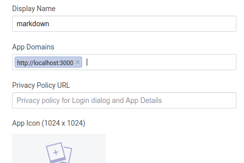
      ---
      ---
  - Scroll down to 'add platform'\
      
      ---
      ---
  - Select 'website'\
      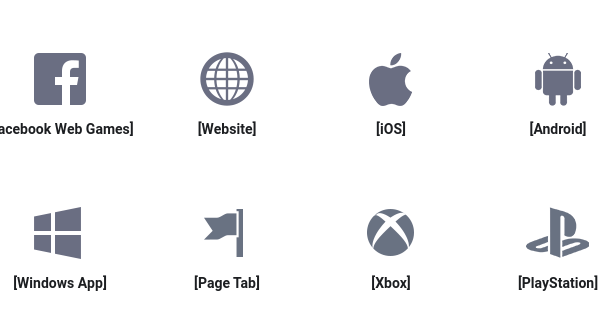
      ---
      ---
  - Website URL is 'http://localhost:3000'\
      
      ---
      ---
  - Save\


  - Github signup at: [github developer](https://github.com/)
  - Go to settings under your profile picture on the right.
      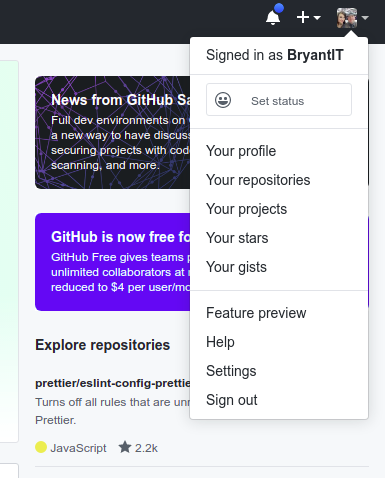
      ---
      ---
  - Go to developer settings
      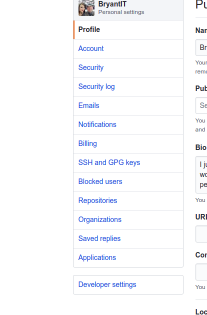
      ---
      ---

  - Oauth Apps
      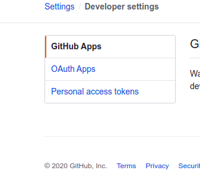
      ---
      ---
  - Select new
      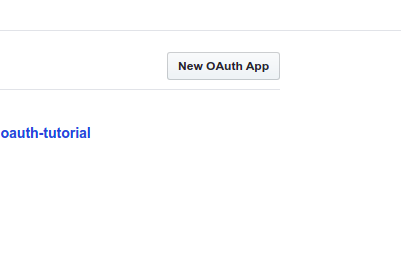
      ---
      ---
  - Give your app a name
  - Hompage url is the domain your website is at. In the example it's "http://localhost:3000"
  - Using the example about your callback url will be "http://localhost:3000/users/auth/github/callback"
  - If you change your routes or domain you will need to update this!
      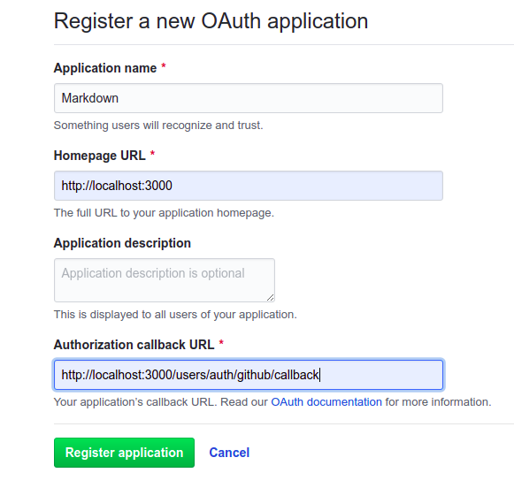
      ---
      ---
  - Copy and paste your id and secret and put it with the others for now.
      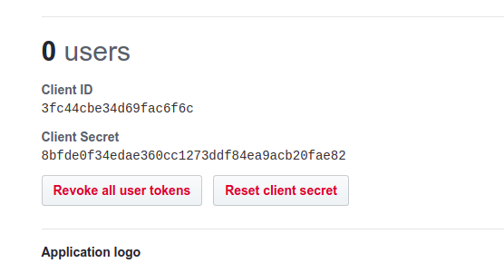
      ---
      ---

## Step 5:
  - Sign up for google here: [google developer](https://console.developers.google.com/)
  - At the top click on the down arrow.
      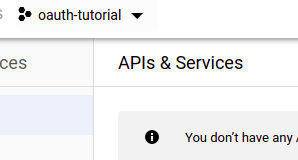
      ---
      ---
  - Click on new project
      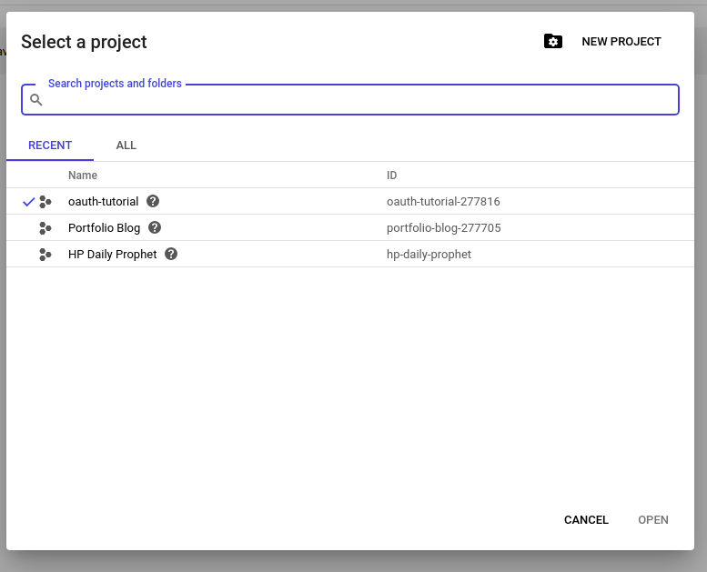
      ---
      ---
  - Fill in your project name and click create
      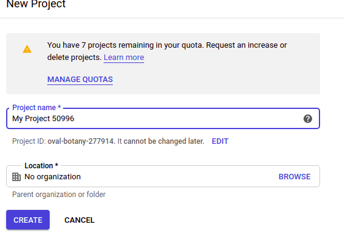
      ---
      ---
  - Return to dashboard and make sure your current project is the one listed at the top. Select "Consent Screen" from the right.  Click on "external" then "create"
      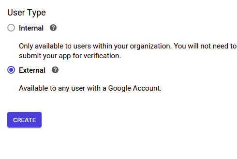
      ---
      ---
 - Fill in application name and leave everything else blank.  Click save
    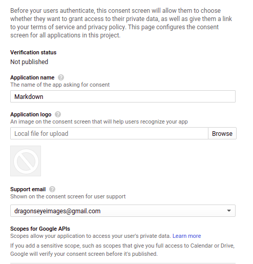
    ---
    ---
 - Click on credentials on the left then select create credentials from the top. After that select OAuth client ID
    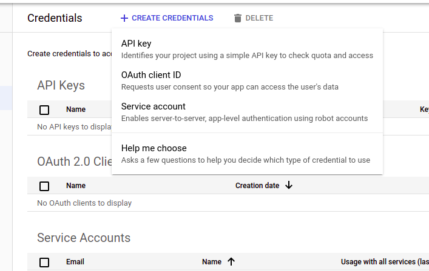
    ---
    ---
 - Under application type select "Web Application", give your app a name.
 - Your JavaScript origin is your local domain. So for the example it is "http://localhost:3000"
 - Your Authorized redirect URI is "http://localhost:3000/users/auth/google_oauth2/callback"
 - Select "Create"
    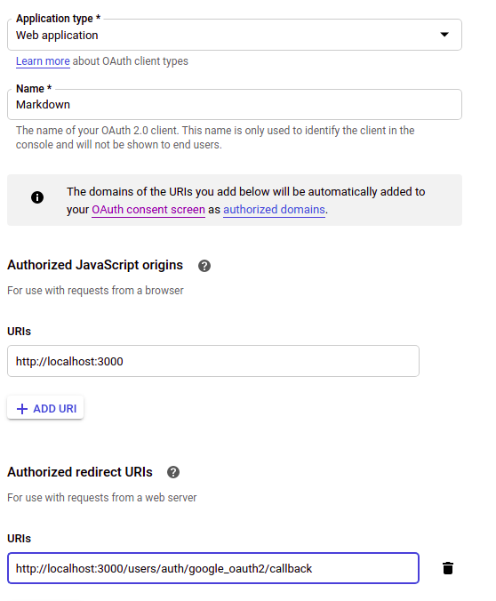
    ---
    ---
- Copy and Paste your Id and secret as before

## Step Five:
### Lets go to the code!  Follow step by step guide for the rest by searching "Step One", "Step Two", and so on!
